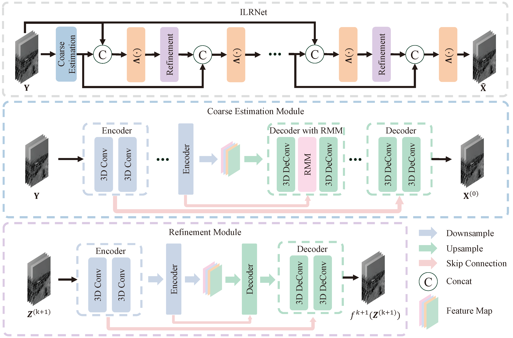

# Iterative Low-rank  Network for Hyperspectral Image Denoising

Jin Ye, Fengchao Xiong, Jun Zhou, and Yuntao Qian, ["Iterative Low-rank  Network for Hyperspectral Image Denoising"](https://ieeexplore.ieee.org/document/10645292) TGRS 2024 


<hr />

> **Abstract:**  Hyperspectral image (HSI) denoising is a crucial preprocessing step for subsequent tasks. The clean HSI usually reside in a low-dimensional subspace, which can be captured by low-rank and sparse representation, known as the physical prior of HSI. It is generally challenging to adequately use such physical properties for effective denoising while preserving image details. This paper introduces a novel iterative low-rank network (ILRNet) to address these challenges. ILRNet integrates the strengths of model-driven and data-driven approaches by embedding a rank minimization module (RMM) within a U-Net architecture. This module transforms feature maps into the wavelet domain and applies singular value thresholding (SVT) to the low-frequency components during the forward pass, leveraging the spectral low-rankness  of HSIs in the feature domain. The parameter, closely related to the hyperparameter of the singular vector thresholding algorithm, is adaptively learned from the data, allowing for flexible and effective capture of low-rankness across different scenarios. Additionally, ILRNet features an iterative refinement process that adaptively combines intermediate denoised HSIs with noisy inputs.  This  manner  ensures progressive enhancement and superior preservation of image details. Experimental results demonstrate that ILRNet achieves state-of-the-art performance in both synthetic and real-world noise removal tasks.
<hr />

## Network Architecture

 

<a id="Models"></a> 

## Models

We provide the [checkpoints](https://drive.google.com/drive/folders/1KN1Ggi0WkMiTIlSj67dTAFktPAvPPWHf?usp=drive_link) of ILRNet.
### Quantitative Comparison on ICVL Dataset
| Method  | [0-15]| [0-55]  | [0-95] | mix |  Corr |
| :------ | :--------: | :--------: | :--------: | :--------: | :----------------------------------------------------------: | 
| [T3SC](https://www.mdpi.com/2072-4292/14/18/4598) | 49.68 | 45.15 | 43.10 | 34.09 | 47.33 |
| [MACNet](https://ieeexplore.ieee.org/document/9631264)  | 48.21 | 43.74 | 41.24 | 28.44 | 45.60 |
| [TRQ3D](https://www.mdpi.com/2072-4292/14/18/4598)  | 46.43 | 44.64 | 43.54 | **39.73** | 46.26 |
| [SST](http://arxiv.org/abs/2211.14090)  | 50.87 | 46.39 | 44.83 | 39.22 | 47.59 |
| [DPNet-S](https://ieeexplore.ieee.org/abstract/document/10258356) | 50.24 | 44.82 | 42.95 | 38.61 | 45.51 |
| [ILRNet](https://ieeexplore.ieee.org/document/10645292)  | **51.22** | **46.88** | **45.46** | 39.06 | **47.80** |


### Quantitative Comparison on Pavia City Center HSI
| Method  | [0-15]| [0-55]  | [0-95] | mix |  Corr |
| :------ | :--------: | :--------: | :--------: | :--------: | :----------------------------------------------------------: | 
| [T3SC](https://www.mdpi.com/2072-4292/14/18/4598) | 41.15 | 36.05 | 34.67 | 28.66 | 38.75 |
| [MACNet](https://ieeexplore.ieee.org/document/9631264)  | 47.25 | 40.88 | 36.63 | 27.73 | 37.41 |
| [TRQ3D](https://www.mdpi.com/2072-4292/14/18/4598)  | 34.64 | 33.36 | 32.62 | 28.23 | 34.33 |
| [SST](http://arxiv.org/abs/2211.14090)  | 44.30 | 37.09 | 36.25 | 31.86 | 36.84 |
| [DPNet-S](https://ieeexplore.ieee.org/abstract/document/10258356) | 45.76 | 39.37 | 39.28 | 34.60 | 39.14 |
| [ILRNet](https://ieeexplore.ieee.org/document/10645292)  | **47.45** | **41.52** | **41.80** | **36.17** | **41.41** |


## Citations

If you find the code helpful in your resarch or work, please cite the following paper(s).

```
@ARTICLE{10645292,
  author={Ye, Jin and Xiong, Fengchao and Zhou, Jun and Qian, Yuntao},
  journal={IEEE Transactions on Geoscience and Remote Sensing}, 
  title={Iterative Low-rank Network for Hyperspectral Image Denoising}, 
  year={2024},
  doi={10.1109/TGRS.2024.3449130}
}

```